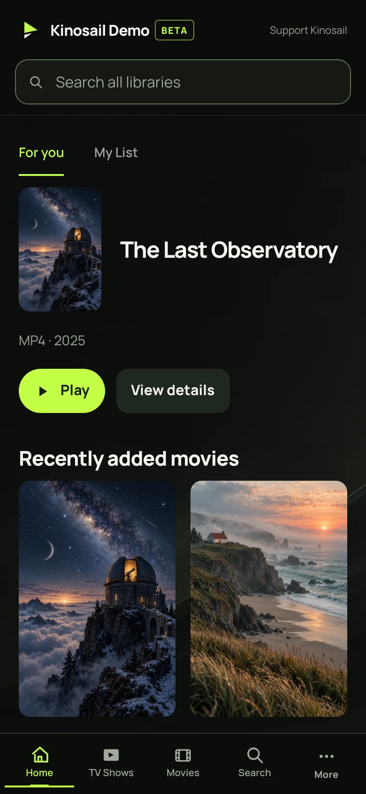

# Kinosail 

Kinosail is a set of self-hosted apps for your media and home network. Run the apps you need on your own hardware. Each app runs in its own container and includes a web interface, API, and database.

Kinosail Player Server is free to run on hardware you control. The web Player is included.

**[Official website](https://kinosail.com/)** · **[Get started](https://kinosail.com/quickstart/)** · **[NAS and Proxmox installs](https://kinosail.com/getting-started/platforms/)** · **[Documentation](https://kinosail.com/docs/)** · **[Player merch](https://kinosail-shop.fourthwall.com/)** · **[Contribute](CONTRIBUTING.md)** · **[Get help](SUPPORT.md)** · **[Security](SECURITY.md)**

## Player preview

<p align="center">
  <a href=".github/assets/player-home-desktop.webp"></a>
  <a href=".github/assets/player-home-mobile.webp"></a>
</p>

These are screenshots of the real Player running in Podman with fictional movies and original demo artwork. [View the film detail screen](.github/assets/player-film-detail.webp).

## Choose your app

| App | What it does | Default local address |
| --- | --- | --- |
| [Kinosail Player](apps/player/README.md) | Browse and play movies, Shows, music, audiobooks, books, and photos. Includes Profiles, playback progress, collections, and compatible playback. | `https://localhost:38127` |
| [Kinosail Subtitles](https://kinosail.com/subtitles/) | Find, validate, and save subtitle sidecars beside your movies and episodes. | `https://localhost:38128` |

Player reads your media and does not change the source files. Subtitles needs write access to save subtitle files beside your media. Kinosail does not relay media. You do not need a Kinosail account for local use.

Subtitles runs in its own [published container](https://github.com/Kinosail/kinosail/pkgs/container/kinosail-subtitles). Follow the [Subtitles Docker guide](https://kinosail.com/subtitles/getting-started/install/) for its writable media mount, or see the [source and test-instance screenshots](apps/subtitles/README.md). Core subtitle features are free; [Supporter badges](https://kinosail.com/subtitles/owner-guide/supporter/) are optional.

## Install on a NAS or Proxmox VE

Use the [Compose file maker](https://kinosail.com/getting-started/platforms/#make-a-ready-to-import-compose-file) to choose Player or Subtitles, enter the server's media path, and download a file ready to import. It works with Synology Container Manager, TrueNAS SCALE, QNAP Container Station, CasaOS, Portainer, Dockge, and Docker Compose. On Proxmox VE, run Docker in a Linux VM with your media share mounted inside the VM. Use the XML template for a local Unraid install.

| App | Original Compose file | Unraid template | Media access | Default HTTPS port |
| --- | --- | --- | --- | --- |
| Player | [Download Compose YAML](https://raw.githubusercontent.com/Kinosail/kinosail/main/apps/player/packaging/platform-compose.yaml) | [Download XML](https://raw.githubusercontent.com/Kinosail/kinosail/main/apps/player/packaging/unraid.xml) | Read-only | `38127` |
| Subtitles | [Download Compose YAML](https://raw.githubusercontent.com/Kinosail/kinosail/main/apps/subtitles/packaging/platform-compose.yaml) | [Download XML](https://raw.githubusercontent.com/Kinosail/kinosail/main/apps/subtitles/packaging/unraid.xml) | Read and write | `38128` |

The file maker fills in `KINOSAIL_MEDIA_PATH` for you. If you download an original Compose file, set that value before importing it. Give container user `10001:10001` the access shown above. The Unraid templates require you to choose the Media path. After starting the app, check that it is healthy, open its HTTPS port, and create the first Owner. Protect a backup key before relying on recovery.

Follow the [platform install guide](https://kinosail.com/getting-started/platforms/) for manager-specific steps, updates, and backup details. The Unraid templates are local files, not Community Apps listings.

## Get started with Kinosail Player

Use the published Player container from GitHub Container Registry. Docker pulls it from `ghcr.io`; you do not need to build from source. These examples keep setup on this computer and mount your media read-only. Replace `/path/to/your/media` with the full path to an existing media folder on the Docker host.

Install Docker Engine. The Compose example also needs the Compose plugin. Kinosail supports 64-bit Linux (`amd64` or `arm64`). Docker Desktop works for local use on macOS.

### Docker (one line)

```sh
docker run --detach --name kinosail --restart unless-stopped --init --user 10001:10001 --read-only --cap-drop ALL --security-opt no-new-privileges:true --publish 127.0.0.1:38127:38127 --mount type=volume,source=kinosail-config,target=/config --mount type=volume,source=kinosail-cache,target=/cache --mount type=volume,source=kinosail-backups,target=/backups --mount "type=bind,source=/path/to/your/media,target=/media,readonly" --tmpfs /tmp:rw,noexec,nosuid,nodev,size=256m --tmpfs /run:rw,noexec,nosuid,nodev,size=16m --env KINOSAIL_DATA_DIR=/config --env KINOSAIL_CACHE_DIR=/cache --env KINOSAIL_MEDIA_DIR=/media ghcr.io/kinosail/kinosail-player:latest
```

### Docker Compose

Create a folder for `compose.yaml` and `.env`. Set `KINOSAIL_MEDIA_PATH` to the full path of an existing media folder on the Docker host:

```dotenv
KINOSAIL_MEDIA_PATH=/path/to/your/media
KINOSAIL_BIND=127.0.0.1
KINOSAIL_PORT=38127
```

Save this as `compose.yaml` in the same folder:

```yaml
name: kinosail

services:
  kinosail:
    image: ghcr.io/kinosail/kinosail-player:latest
    container_name: kinosail
    restart: unless-stopped
    init: true
    user: "10001:10001"
    read_only: true
    cap_drop: [ALL]
    security_opt:
      - no-new-privileges:true
    ports:
      - "${KINOSAIL_BIND:-127.0.0.1}:${KINOSAIL_PORT:-38127}:38127"
    environment:
      KINOSAIL_DATA_DIR: /config
      KINOSAIL_CACHE_DIR: /cache
      KINOSAIL_MEDIA_DIR: /media
    volumes:
      - config:/config
      - cache:/cache
      - backups:/backups
      - "${KINOSAIL_MEDIA_PATH}:/media:ro"
    tmpfs:
      - /tmp:rw,noexec,nosuid,nodev,size=256m
      - /run:rw,noexec,nosuid,nodev,size=16m

volumes:
  config:
  cache:
  backups:
```

Pull and start the container from the folder with `compose.yaml`:

```sh
docker compose pull
docker compose up -d
```

On this computer, open **<https://localhost:38127>**. Your browser will warn you about the local certificate. Trust only the certificate from your own Server. Create the first Owner with a unique password that has at least 12 characters, then add a passkey or TOTP authenticator.

The Compose example saves backup data in a volume, but it does not create an encryption key. Set up a backup key before you rely on encrypted backups. See [Backups and updates](apps/player/docs/owner-guide/backups-and-updates.md).

For signature verification and a pinned image digest, use the [verified Docker quickstart](https://kinosail.com/quickstart/).

## Build the apps from source

Use these steps only if you want to build app images from the source checkout. For a standard Player setup, use the published-container examples above.

### Requirements

- For a source install, install Git and get access to this repository.
- Install Docker Compose or Podman with a Compose provider. On macOS, start the container engine's Linux virtual machine.
- Use a 64-bit Linux host (`amd64` or `arm64`). On macOS, the container engine runs Linux for you.
- For Player or Subtitles, choose a media directory that the container can read or write as required.
- Leave the local ports in the table above free. Allow space for app data, artwork, backups, and playback cache.
- Container builds include the media tools. You do not need Go or FFmpeg on the host.

These source-build commands use Docker Compose. If you use Podman, replace `docker compose` with `podman compose`. Follow only the section for the app you want.

### 1. Get the source

```sh
git clone https://github.com/Kinosail/kinosail.git
cd kinosail
```

These examples build the source that you checked out. For a prebuilt Player container, use the examples in [Get started with Kinosail Player](#get-started-with-kinosail-player).

### 2. Start an app

#### Player

From the repository root:

```sh
cd apps/player
cp .env.example .env
chmod 600 .env
```

Edit `.env`. Set `KINOSAIL_MEDIA_PATH` to the full path of your media directory. Set `KINOSAIL_BACKUP_KEY_FILE=` to an empty value for this source install. Source Compose does not mount the installer's secret file. Automatic encrypted backups need a key. Follow the [backup guide](apps/player/docs/owner-guide/backups-and-updates.md) before you rely on backups.

```sh
docker compose up --build --detach
docker compose logs --tail 50 kinosail
```

On the host, open **<https://localhost:38127>**. Your browser may warn you about the local certificate. Trust only the certificate from your own Server. Create the first Owner with a unique password that has at least 12 characters. Add a passkey or TOTP authenticator. Then [complete first setup](apps/player/docs/getting-started/first-setup.md), add a library, and play an item.

#### Subtitles

From the repository root:

```sh
cd apps/subtitles
cp .env.example .env
chmod 600 .env
```

Set `KINOSAIL_MEDIA_PATH` to the full path of your movie or episode directory. For this source install, clear `KINOSAIL_BACKUP_KEY_FILE=` as described above. The container must be able to write subtitle files in this directory.

```sh
docker compose up --build --detach
docker compose logs --tail 50 kinosail
```

Open **<https://localhost:38128>**. Create and secure the Owner. In Settings, choose a language and a provider. Scan the library and fetch one subtitle before you set up a larger workflow. See the [Subtitles guide](apps/subtitles/docs/README.md) for credentials, matching, automation, and recovery.

### 3. Keep your data and connect other devices

Each source Compose project saves state in named volumes. Keep the same project name and directory when you restart or update an app. Compose uses these values to find the saved data.

From the app directory:

```sh
docker compose ps
docker compose down
docker compose up --detach
```

`down` stops the app and keeps its named volumes. If you add `--volumes`, Compose deletes those volumes and their data.

The web ports use localhost by default. Finish Owner setup before you change access. On a headless host, use a private SSH port forward to open the setup page. Player and Subtitles also map UDP ports for optional private management: 51821 and 51822. Publishing a port does not turn on this feature.

Use [Player device setup](apps/player/docs/getting-started/connect-devices.md) to set up HTTPS on your home network and connect clients. Use [Player remote access](apps/player/docs/owner-guide/remote-access.md) when you need access away from home. Read each app guide for setup details. Public Player access uses a separate, restricted HTTPS gateway. Do not forward the administration port to the internet.

### Published Player installation

Passing builds on `main` publish signed `latest` containers for changed apps. The Player [Docker quickstart](https://kinosail.com/quickstart/) checks the image signature and pins its digest. You do not need a numbered release or installer archive. A successful source build does not prove that a published image is available.

For a numbered release, get the matching app bundle from [Releases](https://github.com/Kinosail/kinosail/releases). Check its checksum and signature. The Player installer uses `cosign` to check the image before it pins the digest. Do not skip this check to install a development image.

## Documentation

Visit **[Kinosail Player Docs](https://kinosail.com/docs/)** for searchable web Player guides, starting with Docker installation.

| Task | Start here |
| --- | --- |
| Install, use, or troubleshoot Player | [Player documentation](apps/player/docs/README.md) |
| Install Subtitles, configure providers, or manage automation | [Subtitles documentation](https://kinosail.com/subtitles/) |
| Configure Player | [Configuration reference](apps/player/docs/reference/configuration.md) |
| Protect and restore Player state | [Backups and updates](apps/player/docs/owner-guide/backups-and-updates.md) |
| Integrate with Player's API or MCP | [Developer guide](apps/player/docs/developer-guide/index.md) |
| Understand the repository and releases | [Engineering guide](engineering/README.md) |
| Report a bug or suggest a change | [Support](SUPPORT.md) |

## Development

The Go workspace contains two app modules and [shared packages](packages/README.md). Use Go 1.27 or newer, as declared in [go.work](go.work). The [contribution guide](CONTRIBUTING.md) covers tool installation, Git workflow, app-scoped commands, and verification.

```sh
make hooks
# Compile one app without starting it:
cd apps/player
go build ./cmd/kinosail
```

**Verification status:** while `.gates-disabled` exists, quality suites and hooks are disabled by repository policy. Do not interpret a skipped command as a pass or remove the marker without maintainer authorization. See [verification policy](CONTRIBUTING.md#verification).

## Repository layout

```text
apps/player/       Player Server, web app, docs, and Apple clients
apps/subtitles/    Subtitle automation Server, web app, and docs
packages/          Shared Go operations and contracts
engineering/       Cross-app architecture, research, and workflows
scripts/           Shared build, quality, and deployment tooling
.github/           Issue forms, PR template, and retained workflows
```

Kinosail Supporter and the Home Assistant integration live in separate repositories. App binaries, containers, versions, and release acceptance remain independent.

## License and contributions

Kinosail is **source-available**, under the [PolyForm Perimeter License 1.0.1](LICENSE). Read [LICENSING.md](LICENSING.md) for repository, third-party, and contribution boundaries. Contributions require the applicable contributor agreement; see [CONTRIBUTING.md](CONTRIBUTING.md). Report vulnerabilities privately using [SECURITY.md](SECURITY.md).

## Continuous integration and releases

GitHub-hosted runners check code quality, app tests, race conditions, browser journeys, dependencies, secrets, and CodeQL. Required checks protect `main`. A failed check blocks a merge or release.

Changed Player and Subtitles containers build on Linux AMD64 and ARM64 runners at the same time. Passing builds on `main` publish signed `latest` images to `ghcr.io/kinosail/kinosail-player` and `ghcr.io/kinosail/kinosail-subtitles`. Numbered releases use tags such as `player-v1.2.3`. CI must pass for the exact commit on `main`. CI scans each architecture before it signs and attests the combined image. Builds include a software bill of materials (SBOM) and provenance.

Release publication does not configure a production deployment target. The existing local deployment watcher remains separate.
