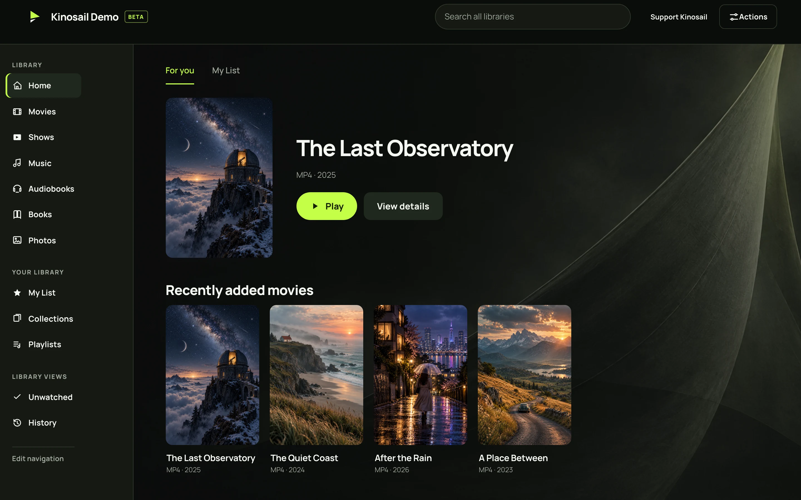
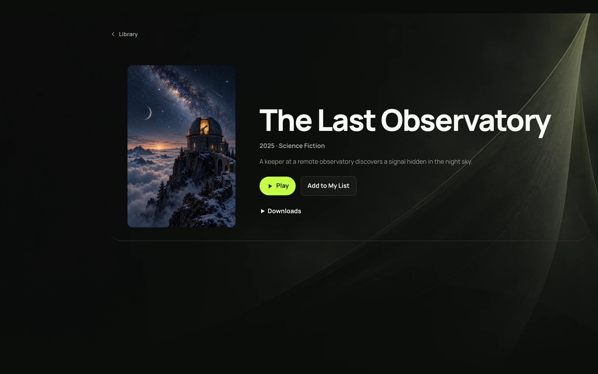
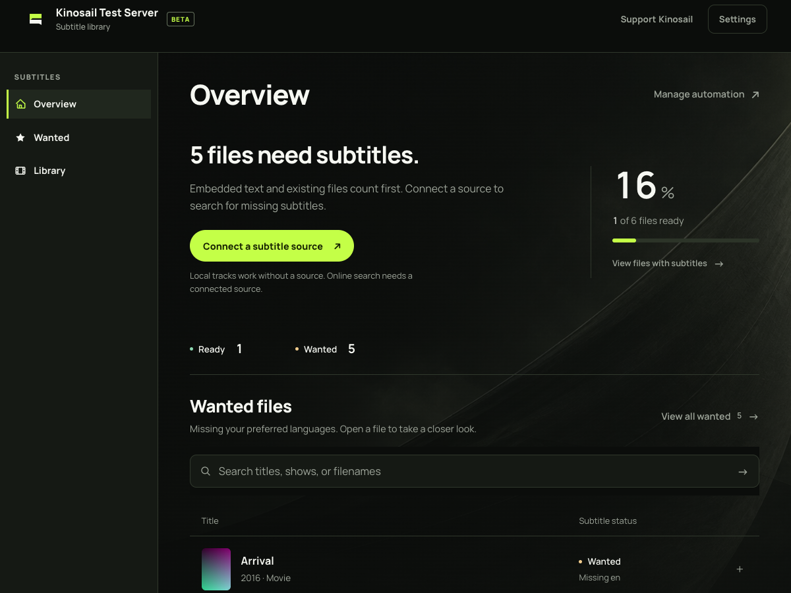

# Kinosail

## All your media. Your hardware. Your evening.

Kinosail Player turns the folders you already own into a personal library for movies, shows, music, audiobooks, books, comics, and photos. Browse in the web Player, pick up where you left off, and play directly when your device supports the source. Kinosail runs on your own hardware, with no Kinosail account or media relay.

**[Install Player](https://kinosail.com/quickstart/)** · **[Explore the website](https://kinosail.com/)** · **[Read the docs](https://kinosail.com/docs/)** · **[Install on a NAS or Proxmox](https://kinosail.com/getting-started/platforms/)**

<p align="center">
  <a href=".github/assets/player-home-desktop.webp"></a>
</p>

<p align="center"><em>The real web Player running in Podman with fictional films and original demo artwork. <a href=".github/assets/player-home-mobile.webp">View the phone screen</a> · <a href="engineering/documentation/DEMO-ASSETS.md">Screenshot provenance</a>.</em></p>

### Made for the whole collection

- **Find something worth watching.** Browse artwork-led shelves, search across your library, and keep films and shows in My List, collections, and playlists. [Explore browsing](https://kinosail.com/user-guide/browse-and-search/).
- **Start with the original.** Direct First playback uses the source when the device can play it, with compatible streaming available when needed and allowed. Choose audio and subtitle tracks, resume playback, and control quality. [See playback behavior](https://kinosail.com/user-guide/playback/).
- **Give everyone their own place.** Viewer Profiles keep progress and access separate. Watch Rooms synchronize a shared session, while offline preparation and device downloads support watching away from your Server. [Explore Player features](https://kinosail.com/features/).
- **Keep control.** The supported Player install mounts original media read-only. One Server container includes the web app, API, and local database. Public viewing, when enabled, uses a separate restricted HTTPS gateway. [Read the security model](https://kinosail.com/security/).

<p align="center">
  <a href=".github/assets/player-film-detail.webp"></a>
</p>

<p align="center"><em>Open a title, see its details, and press Play.</em></p>

## From folder to first play

1. Install Docker on a 64-bit Linux host, or use Docker Desktop on macOS. Choose an existing media folder.
2. Follow the [verified Player quickstart](https://kinosail.com/quickstart/). It checks the published image signature, pins its digest, and mounts your media read-only.
3. Open your Server's local HTTPS address. Create the first Owner, add a passkey or authenticator, then [add a library](https://kinosail.com/getting-started/add-media/).

The Server and web Player are free for local use. The default web port stays on localhost during setup. For Synology, TrueNAS, QNAP, Unraid, Portainer, Dockge, and Proxmox VE, use the [platform install guide](https://kinosail.com/getting-started/platforms/) to prepare a container file for Player, Subtitles, or both.

### Watch on your devices

| Client | Availability |
| --- | --- |
| Web Player | Included with Kinosail Server; works in supported desktop and mobile browsers. |
| Compatible Jellyfin mobile apps | Optional iOS and Android connection after the Owner enables compatibility and trusted HTTPS. [Setup and limits](https://kinosail.com/getting-started/connect-devices/). |
| Kinosail Apple and Android clients | [Apple](apps/player/apps/native/README.md) and [Android](apps/player/apps/android/README.md) source clients are in this repository. Store distribution is not available yet. |

Browser and device format support varies. Scanning a file does not certify direct playback on every device. Check the [media compatibility guide](https://kinosail.com/reference/media-compatibility/) when planning a library.

## Add subtitles without giving up control

[Kinosail Subtitles](https://kinosail.com/subtitles/) is a separate, free app for movies and episodes. It checks existing text tracks, searches the providers you configure, validates matches, and saves sidecar files beside your videos. Choose preferred languages, manage playback choices, and preview optional file cleanup before hiding files with a reversible `.hidden` suffix. It runs without Player and needs a writable media mount.

<p align="center">
  <a href="apps/subtitles/docs/assets/images/subtitles-dashboard-1200.png"></a>
</p>

<p align="center"><em>The real Subtitles app running in Podman with fictional media. <a href="engineering/documentation/subtitles-screenshot-provenance.md">Screenshot provenance</a>.</em></p>

**[Install Subtitles](https://kinosail.com/subtitles/getting-started/install/)** · **[See the Subtitles guide](https://kinosail.com/subtitles/)** · **[Install both apps](https://kinosail.com/getting-started/platforms/)**

## Built for people who run their own systems

| What you need | Where to start |
| --- | --- |
| Configure a Server and protect its data | [Owner guide](https://kinosail.com/owner-guide/) · [Backups and updates](https://kinosail.com/owner-guide/backups-and-updates/) |
| Connect devices or watch away from home | [Device setup](https://kinosail.com/getting-started/connect-devices/) · [Remote access](https://kinosail.com/owner-guide/remote-access/) |
| Build an integration | [Versioned HTTP API](https://kinosail.com/reference/api/) · [MCP guide](https://kinosail.com/developer-guide/mcp/) |
| Build or test the source | [Player source install](https://kinosail.com/source-install/) · [Subtitles source install](https://kinosail.com/subtitles/getting-started/install/#build-from-source) |
| Get help or report a problem | [Support](SUPPORT.md) · [Private security reporting](SECURITY.md) |

Player and Subtitles have independent containers, state, documentation, and releases. Passing builds on protected `main` publish signed `latest` images for changed apps. A numbered release and a deployed Server are separate events.

Kinosail is **source-available under the [PolyForm Perimeter License 1.0.1](LICENSE)**. It is not OSI-approved open source. Read [LICENSING.md](LICENSING.md) before redistributing, rebranding, hosting, or building a competing product. Contributions follow the applicable [contributor agreement](CONTRIBUTING.md).

The web Player is in beta. See [why Kinosail exists](https://kinosail.com/why/) for the project's goals and its use of AI-assisted engineering.

<details>
<summary>For contributors: repository map and checks</summary>

```text
apps/player/       Player Server, web app, docs, and source clients
apps/subtitles/    Subtitle automation Server, web app, and docs
packages/          Shared Go operations and contracts
engineering/       Architecture, research, and delivery guidance
scripts/           Shared build and quality tooling
```

Use the Go version in [go.work](go.work). Start with the [contribution guide](CONTRIBUTING.md) for setup, app-scoped commands, and required checks. GitHub-hosted CI verifies selected app tests, browser journeys, and security gates before integration.

</details>
