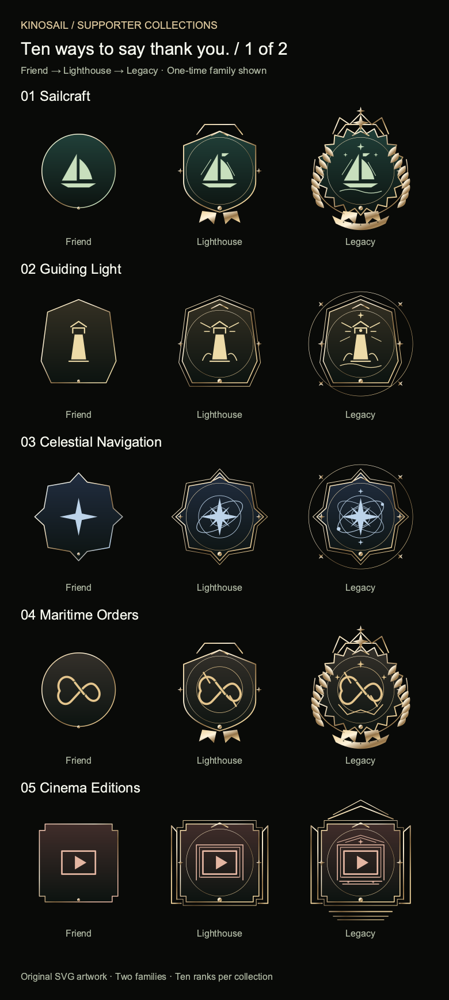
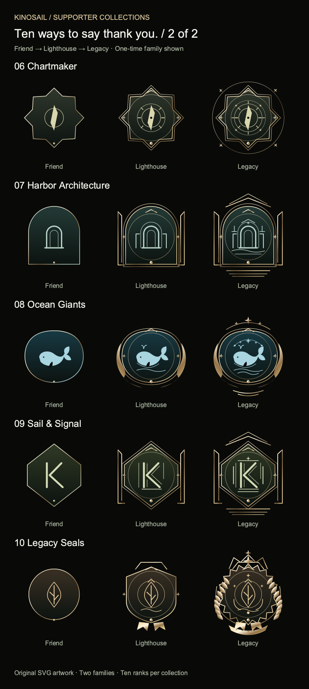
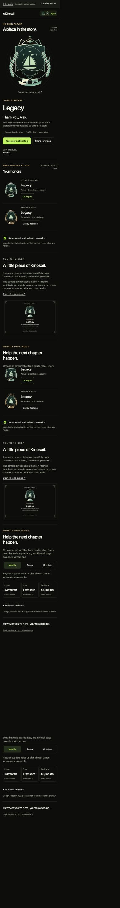

# Kinosail supporter collections

Ten original art directions, ten ranks each, two independent families: **200 display SVGs**, **200 separately simplified navigation SVGs**, and **200 sample vector certificates**. No raster content is embedded in any SVG. PNGs are review exports only.

## View on your phone

[Open the complete 20-page vector booklet](output/pdf/kinosail-supporter-collections.pdf) · [Download the SVG package](supporter-art.zip)

These previews show Friend, Lighthouse, and Legacy. The booklet shows **every rank in both families**.





<details><summary>See the mobile supporter-page concept</summary>



</details>

Open `index.html` for the collection explorer. Open `supporter.html` for the interactive, responsive page proposal. Serve this directory over localhost for the optional native-share demonstration. `supporter-art.zip` contains the complete offline package. The twenty-page vector booklet is `output/pdf/kinosail-supporter-collections.pdf`.

## Design intent

Let supporters enjoy their earned recognition. Lead with the artwork, a sincere thank-you, and a certificate; put contribution choices below. Keep permanent Patron Orders and recurring Living Standards independently meaningful. Show both compact badges in the existing navigation location, with descriptive accessible names. Prefer affordable entry choices, an optional full ten-level list, and no collection-completion pressure. Use a single optional reveal with reduced-motion support. Reflow to one column on phones, with two-column artwork galleries and native preview selects.

The prototype uses sample data, including a sample date and name. No billing, activation, storage, or production behavior is changed. It proposes a private display preference, family selection, archived gratitude, certificate sharing, and renewal copy; these are not new live benefits. Source code, live badge artwork, existing pricing, and certificate verification remain unchanged. Sample certificates explicitly identify themselves as design samples and contain no account identifiers or payment amount.

## Directions

1. Sailcraft: a flagship, pennant, and ceremonial order. Recommended starting point.
2. Guiding Light: a lighthouse surrounded by a growing field of light.
3. Celestial Navigation: astronomical rings and a guiding star.
4. Maritime Orders: an engraved sailor's knot.
5. Cinema Editions: a frame of light with architectural ornament.
6. Chartmaker: a compass instrument with increasingly precise bearings.
7. Harbor Architecture: a welcoming open arch and harbor towers.
8. Ocean Giants: whale, waves, and constellation. A more literal ocean direction.
9. Sail & Signal: a constructed Kinosail-inspired monogram.
10. Legacy Seals: a botanical maker's mark in an heirloom seal.

Ranks 1–3 establish the motif, 4–6 introduce framing and construction, 7–9 gain ceremonial silhouette and motif detail, and 10 finishes the composition. Compact artwork removes engraving detail. Color is supplementary to geometry and the visible rank name.

## Regeneration and verification

Run from this directory. Verification commands remain disabled while the root `.gates-disabled` marker exists; generation does not certify production behavior.

```sh
python3 generate.py
python3 verify.py
node --check studio.js
node --check supporter-preview.js
```

For portable exports, install `cairosvg` and `pypdf` in an isolated Python environment, then run `python export_review.py`. Cairo's shared library is required. `generate.py` and `verify.py` require only Python's standard library.

The pricing is the agreed design context: $3–$75 monthly, $12–$600 annually, and $5–$750 one-time. Friend is $12 annually to preserve an entry equivalent to $1/month; all other annual levels are eight monthly payments. No checkout is connected.
